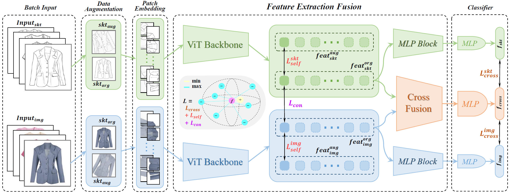

# SketchViT

A framework for Fine-Grained Sketch-Based Image Retrieval (FG-SBIR).

## Section for Reviewers

### 1. New Experimental Results

In response to the reviewers' suggestion, we have conducted additional experiments to evaluate the usability and effectiveness of our proposed model. These experiments were performed using a single Tesla V100 GPU to expedite the training process and obtain results promptly. Except for the different models, other parameter settings are the same. The experiments are as follows:

<br>

<div align=center>

| Methods |  Acc.@1  |  Acc.@5  |  Acc.@10  |  logs  |
|:--------:|:--------:|:--------:|:--------:|:--------:|
| SketchViT w/o Cross Fusion & MLP Block | 52.67 | 83.99 | 92.17 |  [logs](./logs/load/a.log)  |
| SketchViT w/o MLP Block | 52.67 | 83.99 | 92.17 |  [logs](./logs/load/a.log)  |
| SketchViT w/o Cross Fusion | 52.67 | 83.99 | 92.17 |  [logs](./logs/load/a.log)  |
| SketchViT use $feat_{mlp}$ | 52.67 | 83.99 | 92.17 |  [logs](./logs/load/a.log)  |
| **SketchViT** | **67.62** | **91.10** | **95.37** |  [logs](./logs/ours.log)  |

</div>

<br>

- **SketchViT without Cross Fusion & MLP Block**: In this experiment, we removed the Cross Fusion and MLP Block modules from our model. Instead, we directly use the ViT model for feature extraction and optimized the training using the contrastive loss function.

- **SketchViT without Cross Fusion and SketchViT without MLP Block**: In these separate experiments, we removed either the Cross Fusion module or the MLP Block module from our model. The contrastive loss function was still used for training in both cases.

- **SketchViT using $feat_{mlp}$ **: In this experiment, we modified the MLP Block module to directly utilize the output feature $feat_{mlp}$ as the final output $feat_{out}$. The remaining components and the contrastive loss function were kept unchanged.

- **SketchViT**: This refers to our complete model, including both the Cross Fusion and MLP Block modules. All the other comparison experiments were performed using new equipment to ensure consistent experimental conditions and control variables.

By conducting these additional experiments, we aim to provide a comprehensive evaluation of our proposed model's performance and understand the contributions of the Cross Fusion and MLP Block modules. These experiments will enable us to compare the effectiveness of different configurations and assess the impact of each module on the overall performance of SketchViT.


<br>
<br>


## 1. Introduction

### 1.1 Framework

Here is our **SketchViT** framework. 

<br>

<div align=center></div>

<br>

After undergoing data augmentation, the sketches and images from each minibatch are used as inputs and fed into the ViT Backbone for feature encoding. The proposed **MLP Block** and **Cross Fusion module** are employed to explore latent features and fuse them respectively. Finally, these features are mapped to a shared embedding space through the Classifier layer.

Our pre-trained model is avialable [**SketchViT Weights**](https://drive.google.com/drive/folders/1q9ZBhmFUC4NdkF-uRvgiArvxWUVPSo_x).

#### 1.1.1 Train model

- Download the above data, or you can also rename your own data according to the above data naming format.
- Put the dataset into (./src/datasets/) directory.
- You can adjust the parameters of the model according to your needs.
- Use the following command for model training :

```
cd ./src

python main.py --dataset ClothesV1
```

#### 1.1.2 Evaluate model

- Modify the path of the training model and use the following command :

```
python accuracy.py
```

### 1.2 Clothes-V1

<div align=center></div>

<br>

The Clothes-V1 is a newly proposed FG-SBIR dataset that aims to facilitate the search for fashion clothing materials by fashion designers.

The dataset consists of 1200 sketches and 500 corresponding images, which were split into training and test set with ratios of 925 (380) and 275 (120), respectively.

The sketches were drawn by four professional designers and three junior designers, and the sketches are named using the format **xxxxx_0x.png**, where **xxxxx.png** denotes the corresponding image, and **_0x** denotes the designer (e.g., sketch **00066_01.png** and **00066_06.png** correspond to image **00066.png** and were drawn by designers **01** and **06**, respectively). 

For more details, you can download the [**Clothes-V1**](https://drive.google.com/drive/folders/1630UOV7AFPd2BwjgmZHz8igFAZ68mvnR).

<br>

## 2. Experimental Results

### 2.1 QMUL-Chair-V2

<div align=left>

| Methods (QMUL-Chair-V2) |  Acc.@1  |  Acc.@5  |  Acc.@10  |  logs  |
|:--------:|:--------:|:--------:|:--------:|:--------:|
| **Triplet-SN** (CVPR 2016) | 33.75 | 65.94 | 79.26 |  [logs](./logs/baseline/triplet.txt)  |
| **Triplet-Att-SN** (CVPR 2017) | 37.15 | 67.80 | 82.97 |  [logs](./logs/baseline/triplet_att.txt)  |
| **OnTheFly** (CVPR 2020) | 39.01 | 75.85 | 87.00 |  [logs](./logs/baseline/onthefly.txt)  |
| **B-Siamese** (BMVC 2020) | 40.56 | 71.83 | 85.76 |  [logs](./logs/baseline/triplet_inception.txt)  |
| **CMHM-SBIR** (BMVC 2020) | 51.70 | 80.50 | 88.85 |  [logs](./logs/baseline/CMHM.txt)  |
| **SketchAA** (ICCV 2021) | 52.89 | 73.80 | 94.88 |  [logs](./logs/)  |
| **Semi-Sup** (CVPR 2021) | 60.20 | 78.10 | 90.81 |  [logs](./logs/)  |
| **StyleMeUp** (CVPR 2021) | 62.86 | 79.60 | 91.14 |  [logs](./logs/)  |
| **NT-SBIR** (CVPR 2022) | 64.80 | 79.10 | - |  [logs](./logs/)  |
| **XModalViT** (BMVC 2022) | 63.48 | - | 95.02 |  [logs](./logs/)  |
| **SketchViT (Ours)** | **67.62** | **91.10** | **95.37** |  [logs](./logs/ours.log)  |

</div>

### 2.2 Clothes-V1

<div align=left>

| Methods (Clothes-V1) |  Acc.@1  |  Acc.@5  |  Acc.@10  |  logs  |
|:--------:|:--------:|:--------:|:--------:|:--------:|
| **Triplet-SN** (CVPR 2016) | 72.54 | 98.70 | 99.46 |  [logs](./logs/clothes/triplet.txt)  |
| **Triplet-Att-SN** (CVPR 2017) | 75.78 | 98.59 | 99.24 |  [logs](./logs/clothes/triplet_att.txt)  |
| **B-Siamese** (BMVC 2020) | 75.57 | 98.81 | 99.68 |  [logs](./logs/clothes/triplet_inception.txt)  |
| **SketchViT (Ours)** | **89.09** | 97.82 | 98.18 |  [logs](./logs/clothes/SketchViT.log)  |

</div>

### 2.3 ViT with & without MLP

<div align=left>

| Backbone (Acc.@1) |  CIFAR-10  |  CIFAR-100  |  Tiny ImageNet  |  logs  |
|:--------:|:--------:|:--------:|:--------:|:--------:|
| ViT-S/16 | 98.58 | **90.21** | 83.23 |  [logs](./logs/mlp/ViT_S/)  |
| **ViT-S/16(MLP)** | **98.59** | 89.92 | **83.53** |  [logs](./logs/mlp/MLP_S)  |
| ViT-B/16 | 98.26 | 88.27 | 81.39 |  [logs](./logs/mlp/ViT_B)  |
| **ViT-B/16(MLP)** | **98.31** | **88.31** | **82.02** |  [logs](./logs/mlp/MLP_B)  |

</div>

<br>

## 3. Ablation Study

### 3.1 Load Datasets

<div align=left>

| Methods |  Acc.@1  |  Acc.@5  |  Acc.@10  |  logs  |
|:--------:|:--------:|:--------:|:--------:|:--------:|
| LD@A | 52.67 | 83.99 | 92.17 |  [logs](./logs/load/a.log)  |
| **LD@B** | **67.62** | **91.10** | **95.37** |  [logs](./logs/ours.log)  |

</div>

### 3.2 Encoder Type

<div align=left>

| Type |  Acc.@1  |  Acc.@5  |  Acc.@10  |  logs  |
|:--------:|:--------:|:--------:|:--------:|:--------:|
| feat[0] | 64.41 | 89.32 | 95.37 |  [logs](./logs/type/0.log)  |
| mean | 62.99 | 88.97 | 94.66 |  [logs](./logs/type/mean.log)  |
| max | 59.79 | **91.46** | 95.02 |  [logs](./logs/type/max.log)  |
| **MLP Block** | **67.62** | 91.10 | **95.37** |  [logs](./logs/ours.log)  |

</div>

### 3.3 Cross Block Nums

<div align=left>

| Nums |  Acc.@1  |  Acc.@5  |  Acc.@10  |  logs  |
|:--------:|:--------:|:--------:|:--------:|:--------:|
| 1 | 65.13 | 91.10 | 93.59 |  [logs](./logs/nums/1.log)  |
| 2 | 67.26 | 90.39 | 95.73 |  [logs](./logs/nums/2.log)  |
| **3** | **67.62** | 91.10 | 95.37 |  [logs](./logs/ours.log)  |
| 4 | 65.48 | **91.82** | 94.66 |  [logs](./logs/nums/4.log)  |
| 5 | 62.63 | 89.68 | **96.09** |  [logs](./logs/nums/5.log)  |

</div>

### 3.4 Loss Function

<div align=left>

| L<sub>cross</sub> | L<sub>self</sub> | L<sub>con</sub> |  Acc.@1  |  Acc.@5  |  Acc.@10  |  logs  |
|:--------:|:--------:|:--------:|:--------:|:--------:|:--------:|:--------:|
| √ | - | - | 53.74 | 81.85 | 90.75 |  [logs](./logs/loss/both.log)  |
| √ | √ | - | 52.31 | 79.72 | 90.75 |  [logs](./logs/loss/lcon.log)  |
| √ | √* | - | 52.67 | 83.63 | 90.75 |  [logs](./logs/loss/last.log)  |
| √ | - | √ | 62.99 | 90.04 | 95.02 |  [logs](./logs/loss/self.log)  |
| √ | √* | √ | 66.90 | 91.10 | 95.37 |  [logs](./logs/loss/3loss.log)  |
| √ | √ | √ | **67.62** | **91.10** | **95.37** |  [logs](./logs/ours.log)  |

</div>

### 3.5 Embedding Dimension

<div align=left>

| Dims |  Acc.@1  |  Acc.@5  |  Acc.@10  |  logs  |
|:--------:|:--------:|:--------:|:--------:|:--------:|
| 128 | 64.41 | 86.48 | **95.73** |  [logs](./logs/dims/128.log)  |
| **256** | **67.62** | **91.10** | 95.37 |  [logs](./logs/ours.log)  |
| 512 | 64.06 | 90.39 | 94.31 |  [logs](./logs/dims/512.log)  |

</div>

<br>

## 4.  Visualization

### 4.1 Retrieval Performance

<div align=center></div>

### 4.2 Attention Maps (Grad-CAM)

<div align=center></div>

### 4.3 Feature Embedding (T-SNE)

<div align=center></div>

<br>


